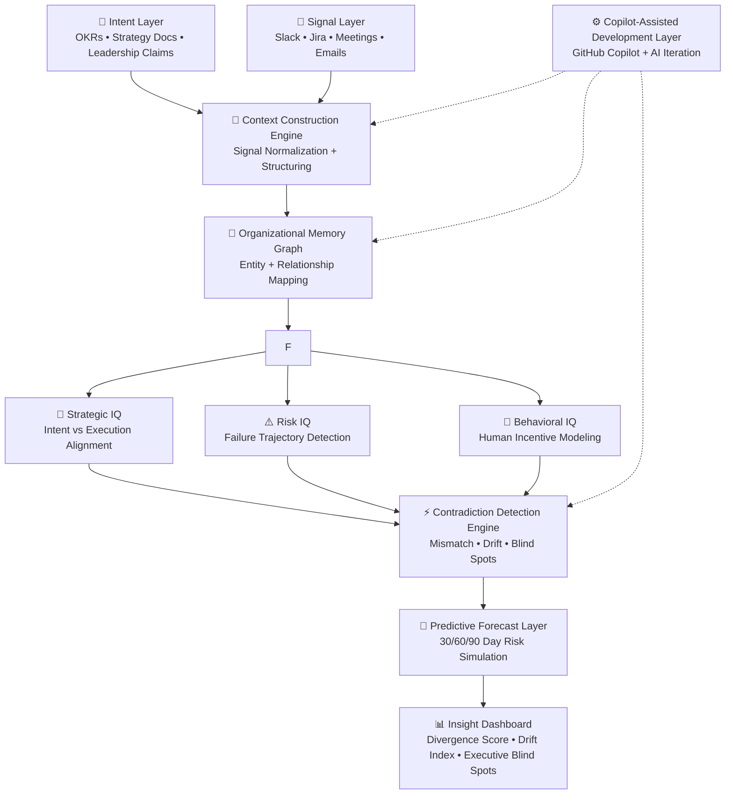

# Undercurrent - Enterprise Reality Intelligence System

---

## ⚠️ “Every organization has two versions of truth — Undercurrent reveals both.”

Undercurrent is NOT a dashboard.

It is an **Enterprise Reality Intelligence System** that continuously detects the gap between:

> What organizations *say they are optimizing for*  
> vs  
> What they are *actually optimizing through behavior*

In most enterprises, this gap is invisible until failure occurs.

Undercurrent makes it visible in real time.

---

# 🧠 The Core Problem

Modern organizations suffer from a silent system failure:

- Strategy says: *Security, Reliability, Compliance*
- Execution behaves like: *Speed, Delivery pressure, Feature output*

This creates a structural mismatch between:
- Intent
- Incentives
- Execution reality

And over time:

> The organization silently drifts away from its own strategy.

Undercurrent is built to detect this drift **before it becomes a crisis.**

---

# 🚀 What Undercurrent Actually Does (SOLUTIION) 

Undercurrent constructs a **Reality Alignment Model** by analyzing:

### 📌 Intent Layer
What leadership *claims matters*
- OKRs
- Strategy docs
- Policy statements

### 📌 Signal Layer
What people *actually do*
- Jira activity
- Slack conversations
- Meeting behavior
- Execution logs

### 📌 Reasoning Layer (AI Core)
A multi-agent intelligence system that detects:
- Contradictions
- Hidden incentives
- Behavioral drift
- Strategic misalignment patterns

---
## 🧠 Architecture Diagram (Interactive Intelligence Flow)

---

# 🧠 Microsoft Agent League Alignment

Built for:

- 🧠 Enterprise Agent Track  
- 🤖 Includes AI Reasoning Systems  
- ⚙️ Copilot-Assisted Development (GitHub Copilot used for architecture + implementation support) 

---

# 🧠 Microsoft IQ Layer Analysis

Undercurrent models organizational intelligence through three IQ dimensions:

---
  

| Layer            | Status                        | Role in Undercurrent                                                                                    | Backed By                                                                           |
| ---------------- | ----------------------------- | ------------------------------------------------------------------------------------------------------- | ----------------------------------------------------------------------------------- |
| 🧠 Strategic IQ  | Active Intelligence Layer     | Measures alignment between declared organizational strategy and real execution behavior                 | OKRs, strategy documents, leadership priorities, workflow execution signals         |
| ⚠️ Risk IQ       | Predictive Intelligence Layer | Detects early indicators of operational, security, and structural failure before they appear in metrics | Drift patterns, anomaly signals, historical execution deviations, escalation trends |
| 👤 Behavioral IQ | Behavioral Intelligence Layer | Models human incentives and detects hidden reward structures driving real decision-making               | Slack communication patterns, Jira behavior, commit patterns, meeting dynamics      |

---

# 🧪 Synthetic Enterprise Scenario

### Company: Cloud Infrastructure Platform

**Declared Strategy:**
- “Reliability and uptime are our top priority”

**Observed Execution:**
- Engineers prioritize feature releases over stability fixes  
- Incident fixes are repeatedly deferred  
- Slack shows deadline-driven urgency over system health  

### Undercurrent Output:
- ⚠️ Strategic contradiction detected  
- 📉 Execution drift toward delivery pressure  
- 🔮 60-day forecast: increasing system instability risk  
- 👁 Executive blind spot: reliability is no longer operational priority  

---

# 🧠 Key Intelligence Modules

## 📊 Reality Divergence Score
Measures gap between declared intent vs execution behavior.

## ⚡ Strategic Contradiction Engine
Detects conflicting priorities inside organizational behavior systems.

## 📉 Organizational Drift Index
Tracks long-term deviation from original strategic direction.

## 👁 Executive Blind Spot Detector
Reveals risks leadership cannot see from internal metrics alone.

## 🔮 30/60/90 Day Failure Forecast
Simulates future organizational risk based on behavioral drift.
 

---

## ⚡ Why Undercurrent is Different

### 🧠 1. It does NOT analyze data — it interprets organizational behavior  
Most AI systems summarize information. Undercurrent detects **structural contradictions across time.**

### 🔍 2. It models hidden incentives, not explicit KPIs  
It reveals:
- What teams are actually rewarded for  
- Not what leadership claims they are rewarded for  

---

## 🏁 Why This Submission Stands Out

Unlike traditional dashboards or AI copilots, Undercurrent introduces:

- A Reality vs Intent intelligence system  
- A predictive organizational failure engine  
- A multi-layer reasoning architecture for enterprises  

It behaves more like a **CT scan for organizations** than a dashboard.

---


# 🔍 Reality vs Pattern Insight

Undercurrent distinguishes between two fundamental signal types:

### 📌 Reality Signals
Actual execution behavior such as:
- Jira activity  
- Code commits  
- Task completion  
- System actions  

### 📌 Pattern Signals
Repeated organizational habits such as:
- Pressure cycles  
- Deadline shortcuts  
- Repeated delays  
- Workarounds in execution  

---

### 🧠 Why this matters
This dual-layer reasoning enables deeper structural understanding beyond surface-level analytics.

---

# 🤖 Agents Used

Undercurrent is built using modular AI reasoning agents:

- 🎯 Intent Parsing Agent  
- 📡 Signal Ingestion Agent  
- 🧠 Context Construction Engine  
- ⚡ Contradiction Detection Agent  
- 🧬 Organizational Memory Graph Agent  
- 🔮 Forecasting & Drift Prediction Agent  

Each agent contributes to a unified enterprise reasoning pipeline.

---
# 🧪 Demo Flow

1. Enter organizational intent (goals / priorities)  
2. Paste or simulate execution signals  
3. Run AI reasoning engine  
4. View outputs:
   - 📊 Divergence Score  
   - ⚡ Contradiction Map  
   - 🔮 Drift Forecast  
   - 👁️ Executive Blind Spots  

---

# ⚙️ Tech Stack

- Next.js (App Router)  
- React  
- TypeScript  
- Tailwind CSS  
- AI Reasoning Engine (Heuristic + Simulated Intelligence)  
- LocalStorage-based simulation layer  
- Mermaid.js (architecture visualization)  

---


# 📊 Observability & Evaluation

Undercurrent includes internal evaluation metrics:

- 📡 Signal consistency score  
- ⚡ Contradiction density index  
- 📉 Drift acceleration tracking  
- 🔮 Forecast confidence scoring  

> This ensures transparency in AI reasoning outputs and makes system behavior auditable.

---

# 🧪 Research Positioning

## 🧠 Existing Systems
- BI dashboards (PowerBI, Tableau)  
- Workflow analytics tools  
- AI copilots (GitHub Copilot, Notion AI)  
- Productivity monitoring tools  

---

## ⚠️ Limitations of Existing Systems
- Focus only on data reporting, not interpretation  
- No reasoning across intent vs execution gap  
- No predictive organizational failure modeling  

---

## 🚀 How Undercurrent is Different
- Introduces organizational cognitive modeling  
- Detects hidden incentive structures  
- Predicts misalignment before it becomes visible  

Undercurrent demonstrates:

- ✔ Enterprise-level AI reasoning design  
- ✔ Multi-agent architecture  
- ✔ Predictive intelligence modeling  
- ✔ Real-world organizational applicability  
- ✔ Copilot-assisted development workflow  

---

# 🛡️ Responsible AI & Data Hygiene

Undercurrent is designed as an **enterprise intelligence system**, but it intentionally avoids accessing or storing sensitive real-world data. Instead, it operates on **synthetic or abstracted organizational signals** to ensure privacy, safety, and controllable reasoning.


## 🧠 Responsible AI Principles

### 🔒 1. No Sensitive Data Dependency
- The system does not require personal user data  
- It operates on **organizational-level abstract signals only**  
- No emails, chats, or logs are stored permanently  

---

### ⚖️ 2. Explainable AI Reasoning
- Every output (Divergence Score, Risk, Drift) is derived from interpretable logic  
- No black-box decision-making in core reasoning engine  
- Each IQ layer has traceable reasoning paths  

---

### 🚫 3. No Behavioral Surveillance Use Case
- The system is NOT designed for employee monitoring  
- It does NOT identify individuals  
- It models **organizational patterns, not personal behavior**  

---

### 🧪 4. Synthetic / Simulated Data First Design
- All demos run on:
  - Synthetic enterprise datasets  
  - Simulated organizational signals  
- Ensures safe experimentation without real-world risk  

---

## 🧼 Data Hygiene Principles

### 📌  Ephemeral Processing
- Inputs are processed in-memory  
- No persistent storage of raw signals by default  

---

### 📌 Data Minimization
Only required features are extracted:
- Intent tags  
- Execution signals  
- Contradiction indicators  

All unnecessary data is discarded immediately.

---

### 📌 Structured Abstraction Layer
All inputs are converted into:
- Normalized intent objects  
- Aggregated execution signals  
- Graph-based organizational memory nodes  

This prevents raw data from entering reasoning layers.

---

### 📌 Safe Output Design
Outputs are:
- Aggregate-level insights only  
- No individual-level identification  
- Focused on system behavior, not people  

---

## 🧠 Why This Matters (Judge Perspective)

Undercurrent is NOT:

❌ Surveillance software  
❌ Employee tracking system  
❌ Data harvesting tool  

It IS:

✔ Enterprise intelligence system  
✔ Organizational reasoning engine  
✔ Strategic misalignment detector  

---

## ⚙️ Responsible AI Alignment

Undercurrent aligns with modern enterprise AI standards:

- Transparency in reasoning  
- Minimal data dependency  
- Simulation-first architecture  
- Non-invasive organizational modeling  

---

UNDERCCURRENT is an Enterprise Reality Intelligence System that transforms organizational behavior into predictive intelligence—revealing hidden contradictions between what companies say and what they actually do before those contradictions become failures.

---


# Project Structure
```bash
undercurrent/
│
├── public/                          # Static assets
│   ├── icons/
│   ├── images/
│   └── demo-assets/
│
├── src/
│
│   ├── app/                         # Next.js App Router
│   │   ├── page.tsx                 # Landing page (Undercurrent intro)
│   │   ├── layout.tsx               # Global layout
│   │   ├── dashboard/               # Main intelligence dashboard
│   │   │   ├── page.tsx
│   │   │   └── components/
│   │   │
│   │   ├── input/                  # Intent + Signal input system
│   │   │   └── page.tsx
│   │   │
│   │   └── results/                # AI output visualization layer
│   │       └── page.tsx
│
├── components/                     # Reusable UI components
│   ├── ui/                         # Buttons, cards, inputs
│   ├── charts/                     # Divergence charts, drift graphs
│   ├── layout/                     # Navbar, sidebar
│   └── insights/                   # IQ outputs UI components
│
├── agents/                         # 🧠 AI Agent Layer (Core System)
│   ├── intent-agent.ts             # Parses organizational intent
│   ├── signal-agent.ts             # Processes execution signals
│   ├── contradiction-agent.ts      # Detects mismatches
│   ├── risk-agent.ts               # Risk IQ engine
│   ├── behavioral-agent.ts        # Behavioral IQ engine
│   └── forecast-agent.ts          # 30/60/90 day prediction
│
├── engine/                         # 🧠 Reasoning Core (Brain of system)
│   ├── context-builder.ts          # Builds organizational memory graph
│   ├── iq-engine.ts                # Microsoft IQ layer logic
│   ├── divergence-engine.ts        # Calculates intent vs execution gap
│   └── pattern-detector.ts         # Detects behavioral patterns
│
├── data/                           # Mock + synthetic enterprise data
│   ├── sample-intents.json
│   ├── sample-signals.json
│   └── synthetic-org-model.json
│
├── lib/                            # Utilities + helpers
│   ├── scoring.ts                  # Divergence + risk scoring logic
│   ├── formatters.ts               # Data formatting
│   ├── constants.ts                # System constants
│   └── utils.ts
│
├── hooks/                          # Custom React hooks
│   ├── useSignals.ts
│   ├── useIQEngine.ts
│   └── useForecast.ts
│
├── styles/                         # Global styles
│   └── globals.css
│
├── types/                          # TypeScript definitions
│   ├── intent.ts
│   ├── signal.ts
│   ├── iq.ts
│   └── organization.ts
│
├── utils/                          # Pure helper functions
│   ├── drift-calculator.ts
│   ├── contradiction-mapper.ts
│   └── risk-scorer.ts
│
├── middleware.ts                   # Optional request handling layer
├── next.config.js
├── tailwind.config.js
├── tsconfig.json
└── package.json
```
